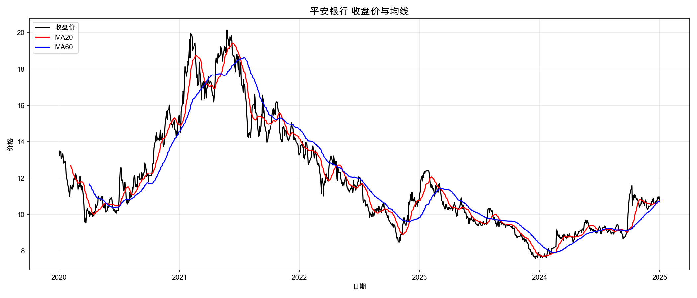
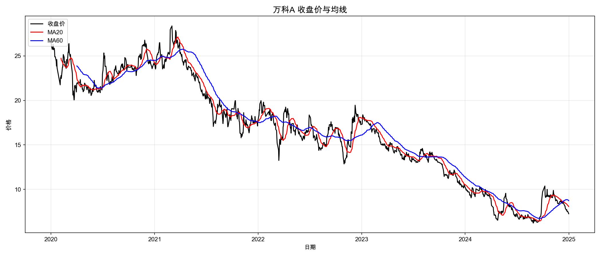
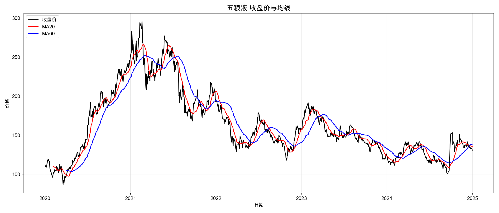
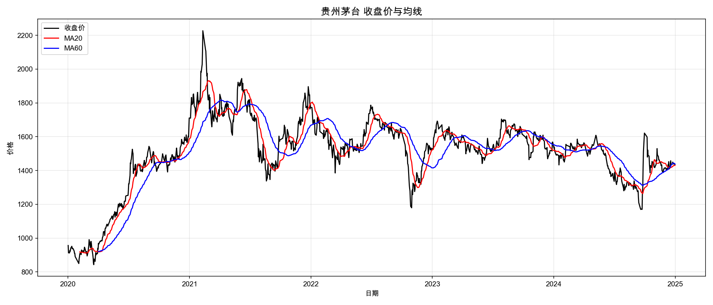
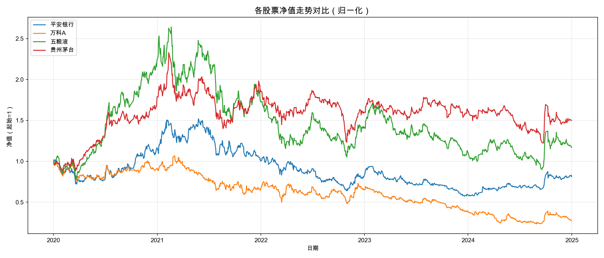
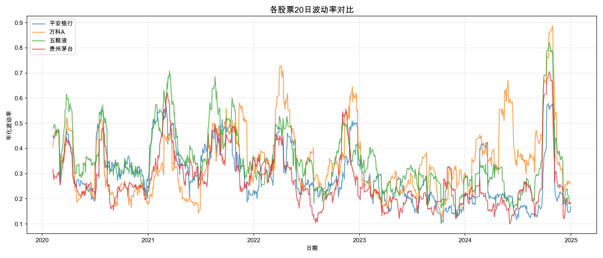
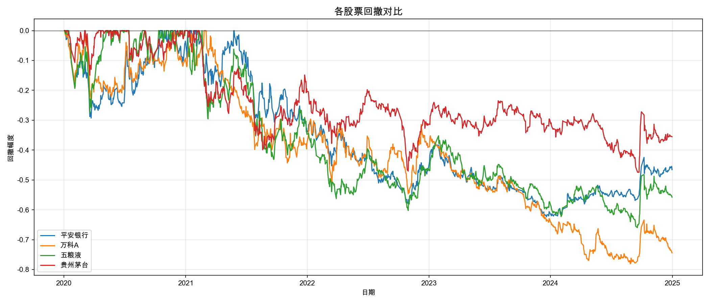
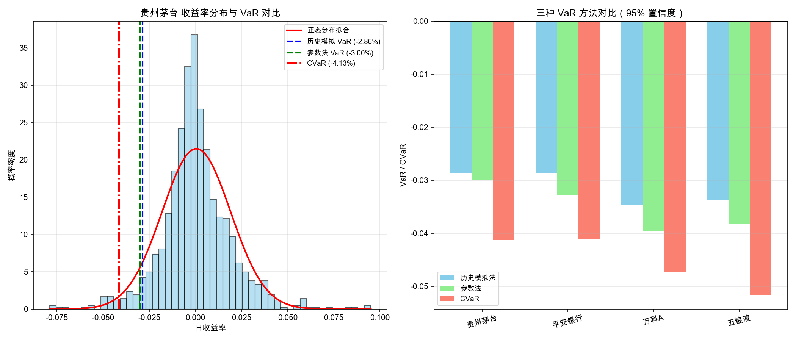

# A-share Factor Strategy and Risk Management

A quantitative research project on A-share factor investing, backtesting, and portfolio risk management.

---

## Project Overview

- Built a complete data pipeline for 4 A-share stocks (2020–2024)
- Designed a reversal factor strategy with monthly rebalancing
- Implemented backtesting with Sharpe Ratio, Max Drawdown, and Win Rate
- Quantified downside risk using VaR, CVaR, and stress testing scenarios

---

## Results

- 118 trading signals generated across 4 stocks
- Full risk report including VaR, CVaR, and stress test results

---

## Visual Outputs

### Price & Moving Averages

| Stock | Chart |
|-------|-------|
| 平安银行 |  |
| 万科A |  |
| 五粮液 |  |
| 贵州茅台 |  |

### Performance Comparison

| Chart | Description |
|-------|-------------|
|  | Normalized equity curves for 4 stocks (2020–2024) |
|  | 20-day rolling volatility comparison |

### Risk Analysis

| Chart | Description |
|-------|-------------|
|  | Maximum drawdown comparison across stocks |
|  | VaR vs CVaR comparison (95% confidence) |

---

## Files

- `Day_1.py` - Data download (baostock)
- `Day_2.py` - Technical indicators (MA, volatility)
- `Day_3.py` - Multi-stock analysis, Sharpe ratio, drawdown, VaR
- `Day_5.py` - Advanced risk: parametric VaR, CVaR, stress testing
- `Day_7.py` - Strategy signal generation (118 signals)

---

## How to Run

```bash
pip install baostock pandas numpy matplotlib scipy
python Day_1.py
python Day_2.py
python Day_3.py
python Day_5.py
python Day_7.py
